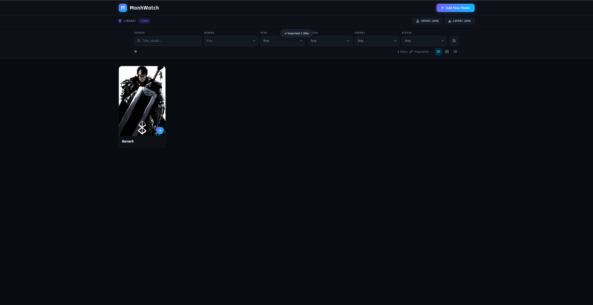

# 🗂️ Anime & Media Library

A sleek, dark-themed personal media tracker built with vanilla HTML, CSS, and JavaScript — no frameworks, no backend, no accounts required. Browse, filter, add, edit, and export your entire anime, manga, manhwa, and more collection from a single local file.



---

## ✨ Features

### 📚 Library Management

- **Add titles** via a full-featured modal form
- **Edit or delete** any entry directly from its card
- **Unsaved-changes guard** — warns you before closing the tab if you have unexported edits

### 🔍 Filtering & Search

- **Full-text search** by title or studio
- **Multi-select genre filter** drawn from `Genres.json` — covers genres, themes, settings, demographics, character types, activities, format tags, and relationship tags
- Filter by **Year**, **Season**, **Format**, and **Status**
- Active filters shown as dismissible **tag pills**
- **Sort** by rating (ascending or descending)
- Live **results count** updates as you filter

### 🖼️ Three View Modes

| Mode               | Description                                    |
| ------------------ | ---------------------------------------------- |
| **Grid**           | Compact poster cards — default on wide screens |
| **Detailed**       | Larger cards with more metadata visible        |
| **Compact / List** | Dense single-row list                          |

Responsive breakpoints automatically switch views on narrower screens.

### 📦 Import / Export

- **Export JSON** — downloads your entire library as a timestamped `.json` file (e.g. `media-library-2026-04-30.json`)
- **Import JSON** — loads a previously exported file and appends all entries to the current grid
- Cover images are stored as **base64 strings** inside the JSON, so the file is fully self-contained

### 🗃️ Per-Entry Fields

| Field                          | Notes                                                                                                               |
| ------------------------------ | ------------------------------------------------------------------------------------------------------------------- |
| Title                          | Required                                                                                                            |
| Studio / Author                | Optional                                                                                                            |
| Format                         | TV Show, Movie, Manhwa, Manga, Web Novel, Comics                                                                    |
| Episodes / Chapters / Duration | Label adapts to format                                                                                              |
| Season & Year                  | Winter · Spring · Summer · Fall                                                                                     |
| Status                         | Adapts to format (Ongoing/Completed/Hiatus/Cancelled for written; Released/Upcoming/In Production for movies; etc.) |
| Rating                         | 0–100 % displayed as a score badge                                                                                  |
| Genres                         | Multi-select from the full `Genres.json` tag library                                                                |
| Cover Image                    | Upload any image — stored as base64                                                                                 |
| Chapter / Episode Link         | Opens in a new tab from an arrow button on the card                                                                 |
| Description                    | Short synopsis / notes                                                                                              |

---

## 📁 File Structure

```
anime-library/
├── anime.html          # Main app shell
├── anime.css           # All styles (dark theme, design tokens, responsive)
├── anime.js            # All logic (filtering, modal, import/export, cards)
├── Genres.json         # Master tag list (genres, themes, demographics, etc.)
├── media-library-*.json  # Your exported library data (not tracked by default)
├── logo-lockup.svg     # Brand logo with text
├── logo-mark.svg       # Brand icon only
└── preview.png         # Screenshot for this README
```

---

## 🚀 Getting Started

Because `anime.js` fetches `Genres.json` with the Fetch API, the app needs to be served over HTTP — it won't work from a plain `file://` URL in most browsers.

### Option A — VS Code Live Server (recommended)

1. Install the [Live Server](https://marketplace.visualstudio.com/items?itemName=ritwickdey.LiveServer) extension
2. Right-click `anime.html` → **Open with Live Server**

### Option B — Python (no install needed)

```bash
# Python 3
python -m http.server 8080
# then open http://localhost:8080/anime.html
```

### Option C — Node.js

```bash
npx serve .
```

---

## 🏷️ Genre / Tag System

All tags are sourced from `Genres.json`, which is loaded asynchronously at startup. The file is organized into named categories, but the app merges them into one **deduplicated, alphabetically sorted** list for both the filter bar and the Add/Edit modal.

| Category             | Examples                                                |
| -------------------- | ------------------------------------------------------- |
| Genres               | Action, Drama, Horror, Romance, Sci-Fi…                 |
| Themes & Topics      | Betrayal, Cultivation, Isekai, Reincarnation, Survival… |
| Settings             | Campus, Cyberpunk, Imperial Court, Urban Fantasy…       |
| Demographics         | Seinen, Shounen, Josei, Shoujo, Boys' Love, Yuri…       |
| Character Types      | Anti-Hero, Villainess, Tsundere, Yandere, Elf…          |
| Activities & Hobbies | Martial Arts, E-Sports, Swordplay, Band…                |
| Format & Style       | 4-koma, Full Color, Long Strip, Episodic…               |
| Relationship Tags    | Enemies to Lovers, Love Triangle, Fake Relationship…    |
| Misc                 | Award Winning, Heartwarming, Inspirational…             |

To add or remove tags, just edit `Genres.json` — no code changes needed.

---

## 📄 JSON Library Format

Each entry in an exported library file follows this shape:

```json
[
  {
    "title": "Berserk",
    "studio": "Gaga",
    "desc": "Guts, known as the Black Swordsman…",
    "genres": ["Action", "Dark", "Demons", "Gore"],
    "year": "1989",
    "season": "Winter",
    "format": "Manhwa",
    "status": "Airing",
    "chapterLink": "https://mangadex.org/title/…",
    "rating": 96,
    "episodes": "383",
    "cover": "data:image/jpeg;base64,/9j/4AAQ…"
  }
]
```

The file is a plain JSON array — you can hand-edit it, write scripts to populate it, or maintain it however you like.

---

## 🎨 Design System

All colours are defined as CSS custom properties in `:root` inside `anime.css`:

| Token       | Value     | Usage                   |
| ----------- | --------- | ----------------------- |
| `--bg`      | `#080b10` | Page background         |
| `--surface` | `#0d1117` | Header, cards           |
| `--accent`  | `#00c2ff` | Tags, highlights, links |
| `--accent2` | `#7b5cfa` | Secondary accents       |
| `--gold`    | `#f5c842` | Rating badge            |
| `--green`   | `#3de89b` | Success toast           |
| `--red`     | `#ff4d6a` | Error toast, delete     |

Fonts are loaded from Google Fonts:

- **Rajdhani** — headings and UI labels
- **Nunito** — body text and descriptions

---

## 🔒 Privacy

Everything runs 100% locally in your browser. No data is ever sent to a server. Your library lives in the exported JSON file on your own machine.

---

## 🛠️ Tech Stack

| Layer  | Technology                                       |
| ------ | ------------------------------------------------ |
| Markup | HTML5                                            |
| Styles | Vanilla CSS (custom properties, grid, flexbox)   |
| Logic  | Vanilla JavaScript (ES2020+, no dependencies)    |
| Icons  | [Font Awesome 6](https://fontawesome.com/) (CDN) |
| Fonts  | [Google Fonts](https://fonts.google.com/) (CDN)  |
| Data   | JSON                                             |

---

## 📋 Roadmap / Ideas

- [ ] Persistent storage via `localStorage` so the library survives page refresh without a manual import
- [ ] Drag-and-drop card reordering
- [ ] Multiple lists / shelves (Reading, Plan to Read, Dropped…)
- [ ] Dark/light theme toggle
- [ ] Additional sort options (title A–Z, year, date added)
- [ ] Bulk delete / bulk tag editing
- [ ] Year filter range (from / to) instead of single year

---

## 📝 License

This project is for personal use. Feel free to fork and adapt it for your own library.
